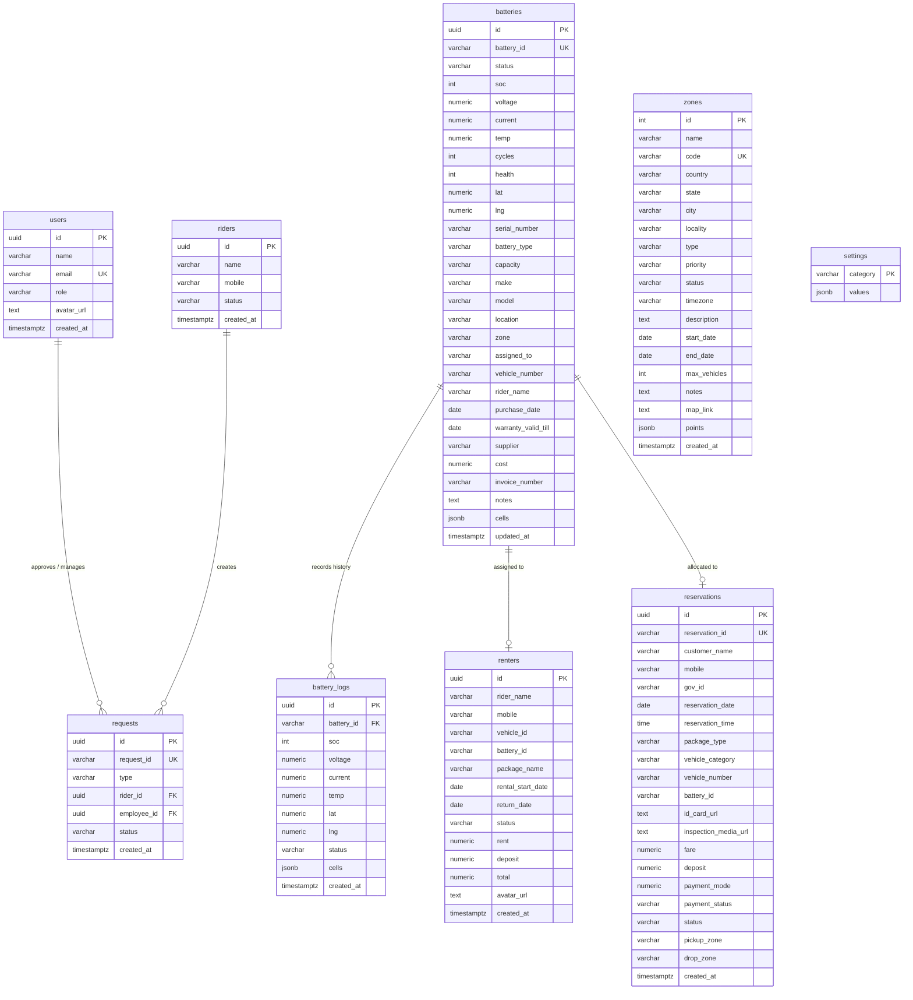

# Evegah EV SaaS Platform - API and Database Reference

This document provides a comprehensive technical reference of the database architecture and API endpoints for the Evegah EV SaaS Platform. It is designed to serve as a developer and integration guide for backend, frontend, mobile apps (Rider and BMS), and external system integrations.

---

## 1. Database Architecture & Schema

The platform uses **PostgreSQL** as its primary relational database. UUIDs are used for resource identification to enable secure, non-sequential, and distributed ID generation.

### 1.1 Entity Relationship Diagram (ERD)

The following diagram illustrates the relationship between the key database entities.



---

### 1.2 Database Table Definitions

#### Table: `users`
Stores details of the platform's operators, managers, and employees who access the admin dashboard.
* **`id`**: `UUID` (Primary Key, default: `uuid_generate_v4()`)
* **`name`**: `VARCHAR(100)` (Not Null) - Full name of the user.
* **`email`**: `VARCHAR(150)` (Unique, Not Null) - User email used for login/identification.
* **`role`**: `VARCHAR(50)` (Default: `'Employee'`) - Security and access role (e.g., Admin, Employee, Operator).
* **`avatar_url`**: `TEXT` (Nullable) - URL link to user profile picture.
* **`created_at`**: `TIMESTAMPTZ` (Default: `NOW()`) - Time the user record was created.

#### Table: `riders`
Stores riders registered on the system who use the Evgah Rider App.
* **`id`**: `UUID` (Primary Key, default: `uuid_generate_v4()`)
* **`name`**: `VARCHAR(100)` (Not Null) - Full name of the rider.
* **`mobile`**: `VARCHAR(20)` (Not Null) - Mobile contact number.
* **`status`**: `VARCHAR(50)` (Default: `'active'`) - Account status (e.g., active, suspended, pending_approval).
* **`created_at`**: `TIMESTAMPTZ` (Default: `NOW()`) - Registration timestamp.

#### Table: `requests`
Tracks operational workflows initiated by riders, such as swaps, returns, and extensions.
* **`id`**: `UUID` (Primary Key, default: `uuid_generate_v4()`)
* **`request_id`**: `VARCHAR(30)` (Unique, Not Null) - Human-readable request reference (e.g., `REQ-2024-0518-0012`).
* **`type`**: `VARCHAR(50)` (Not Null) - Operational type (e.g., `new_rider`, `retain_rider`, `return_ride`, `extend_ride`, `battery_swap`).
* **`rider_id`**: `UUID` (Foreign Key -> `riders.id`) - The rider who initiated this request.
* **`employee_id`**: `UUID` (Foreign Key -> `users.id`, Nullable) - The operator who processed or approved the request.
* **`status`**: `VARCHAR(50)` (Default: `'pending'`) - Request status (e.g., `pending`, `in_progress`, `completed`, `cancelled`, `rejected`).
* **`created_at`**: `TIMESTAMPTZ` (Default: `NOW()`) - Timestamp when request was submitted.

#### Table: `batteries`
Stores inventory and telemetry data for Smart IoT Batteries.
* **`id`**: `UUID` (Primary Key, default: `uuid_generate_v4()`)
* **`battery_id`**: `VARCHAR(50)` (Unique, Not Null) - Smart battery identifier (e.g., `BAT-450X-12340001`).
* **`status`**: `VARCHAR(30)` (Default: `'idle'`) - Operational status (e.g., `idle`, `charging`, `assigned`, `maintenance`, `alert`).
* **`soc`**: `INT` (Default: `100`) - State of Charge percentage (0-100%).
* **`voltage`**: `NUMERIC(5, 2)` (Nullable) - Volts output.
* **`current`**: `NUMERIC(5, 2)` (Nullable) - Amperes current draw.
* **`temp`**: `NUMERIC(4, 1)` (Nullable) - Internal battery temperature in Celsius.
* **`cycles`**: `INT` (Default: `0`) - Number of complete charge/discharge cycles.
* **`health`**: `INT` (Default: `100`) - State of Health percentage (0-100%).
* **`lat`**: `NUMERIC(9, 6)` (Nullable) - GPS Latitude.
* **`lng`**: `NUMERIC(9, 6)` (Nullable) - GPS Longitude.
* **`serial_number`**: `VARCHAR(100)` (Nullable) - Manufacturer physical serial number.
* **`battery_type`**: `VARCHAR(50)` (Default: `'Li-ion'`) - Cell chemistry (e.g., Li-ion, LFP).
* **`capacity`**: `VARCHAR(30)` (Nullable) - Total charge capacity (e.g., `40Ah`).
* **`make`**: `VARCHAR(100)` (Nullable) - Battery manufacturer.
* **`model`**: `VARCHAR(100)` (Nullable) - Model name/number.
* **`location`**: `VARCHAR(150)` (Nullable) - Text description of physical location.
* **`zone`**: `VARCHAR(150)` (Nullable) - Code or name of the geofenced zone the battery belongs to.
* **`assigned_to`**: `VARCHAR(100)` (Nullable) - Name/ID of driver or station currently possessing the battery.
* **`vehicle_number`**: `VARCHAR(50)` (Nullable) - EV registration number if installed in a vehicle.
* **`rider_name`**: `VARCHAR(100)` (Nullable) - Currently assigned rider's name.
* **`purchase_date`**: `DATE` (Nullable) - Date of purchase.
* **`warranty_valid_till`**: `DATE` (Nullable) - Expiry date of warranty.
* **`supplier`**: `VARCHAR(150)` (Nullable) - Supplier company name.
* **`cost`**: `NUMERIC(10, 2)` (Nullable) - Purchase price.
* **`invoice_number`**: `VARCHAR(100)` (Nullable) - Purchase invoice reference.
* **`notes`**: `TEXT` (Nullable) - Miscellaneous service logs/notes.
* **`cells`**: `JSONB` (Default: `'[]'`) - Individual series-cell voltage array details (for BMS diagnostic app).
* **`updated_at`**: `TIMESTAMPTZ` (Default: `NOW()`) - Timestamp of the last received IoT telemetry broadcast.

#### Table: `battery_logs`
Historical logs of battery IoT telemetry, used for rendering metrics charts and historical path traces.
* **`id`**: `UUID` (Primary Key, default: `uuid_generate_v4()`)
* **`battery_id`**: `VARCHAR(50)` (Foreign Key -> `batteries.battery_id` ON DELETE CASCADE) - Related battery.
* **`soc`**: `INT` (Nullable) - State of Charge recorded at this timestamp.
* **`voltage`**: `NUMERIC(5, 2)` - Voltage recorded.
* **`current`**: `NUMERIC(5, 2)` - Current recorded.
* **`temp`**: `NUMERIC(4, 1)` - Temperature recorded.
* **`lat`**: `NUMERIC(9, 6)` - Latitude location.
* **`lng`**: `NUMERIC(9, 6)` - Longitude location.
* **`status`**: `VARCHAR(30)` - Operating status at timestamp.
* **`cells`**: `JSONB` (Default: `'[]'`) - Full voltage readings array of internal cells.
* **`created_at`**: `TIMESTAMPTZ` (Default: `NOW()`) - Log record creation time.

#### Table: `renters`
Detailed logs of EV rental agreements.
* **`id`**: `UUID` (Primary Key, default: `uuid_generate_v4()`)
* **`rider_name`**: `VARCHAR(100)` (Not Null) - Renter's full name.
* **`mobile`**: `VARCHAR(20)` (Not Null) - Renter's contact phone number.
* **`vehicle_id`**: `VARCHAR(50)` (Not Null) - Rented vehicle identifier code.
* **`battery_id`**: `VARCHAR(50)` (Not Null) - Assigned battery ID.
* **`package_name`**: `VARCHAR(100)` (Not Null) - Subscription/Rental package selected (e.g., Weekly Pro, Monthly Business).
* **`rental_start_date`**: `DATE` (Not Null) - Rental commencement date.
* **`return_date`**: `DATE` (Nullable) - Expected or actual lease return date.
* **`status`**: `VARCHAR(30)` (Default: `'Active Ride'`) - Agreement status (e.g., `Active Ride`, `Retain Ride`, `Return`, `Extend`).
* **`rent`**: `NUMERIC(10, 2)` (Not Null) - Rental charges amount.
* **`deposit`**: `NUMERIC(10, 2)` (Not Null) - Refundable security deposit.
* **`total`**: `NUMERIC(10, 2)` (Not Null) - Total billing amount (Rent + Deposit).
* **`avatar_url`**: `TEXT` (Nullable) - URL linking to the renter's photo.
* **`created_at`**: `TIMESTAMPTZ` (Default: `NOW()`) - Record entry date.

#### Table: `reservations`
EV bookings and customer reservations, containing payment details, documents, and cancellation structures.
* **`id`**: `UUID` (Primary Key, default: `uuid_generate_v4()`)
* **`reservation_id`**: `VARCHAR(50)` (Unique, Not Null) - Reservation transaction ID (e.g., `RID-2026-128001`).
* **`customer_name`**: `VARCHAR(100)` (Not Null) - Customer booking name.
* **`mobile`**: `VARCHAR(20)` (Not Null) - Customer phone number.
* **`gov_id`**: `VARCHAR(50)` (Not Null) - Government ID document number (Aadhaar, Passport, DL).
* **`reservation_date`**: `DATE` (Not Null) - Date of scheduled booking pickup.
* **`reservation_time`**: `TIME` (Not Null) - Scheduled pickup time.
* **`package_type`**: `VARCHAR(50)` (Not Null) - Chosen rental cycle package (e.g., Hourly, Day, Weekly, Monthly).
* **`vehicle_category`**: `VARCHAR(50)` (Not Null) - EV category type (e.g., Hatchback, Sedan, SUV).
* **`vehicle_number`**: `VARCHAR(50)` (Nullable) - Assigned EV registration plate number (added during vehicle allocation).
* **`battery_id`**: `VARCHAR(50)` (Nullable) - Linked battery package.
* **`id_card_url`**: `TEXT` (Nullable) - URL to uploaded customer identity document scan.
* **`inspection_media_url`**: `TEXT` (Nullable) - URL to vehicle hand-over inspection video/images.
* **`fare`**: `NUMERIC(10, 2)` (Not Null) - Booking fare.
* **`deposit`**: `NUMERIC(10, 2)` (Not Null) - Required security deposit.
* **`payment_mode`**: `VARCHAR(50)` (Not Null) - Method of payment (UPI, Card, Cash).
* **`payment_status`**: `VARCHAR(30)` (Default: `'Paid'`) - Payment status (e.g., `Paid`, `Refunded`, `Failed`).
* **`status`**: `VARCHAR(30)` (Default: `'Upcoming'`) - Rental status (e.g., `Upcoming`, `Completed`, `Cancelled`).
* **`pickup_zone`**: `VARCHAR(100)` (Nullable) - Outbound collection station zone name.
* **`drop_zone`**: `VARCHAR(100)` (Nullable) - Inbound return station zone name.
* **`created_at`**: `TIMESTAMPTZ` (Default: `NOW()`) - Reservation timestamp.

#### Table: `zones`
Operational geofenced boundaries, charging clusters, and parking territories.
* **`id`**: `SERIAL` (Primary Key) - Sequential integer ID.
* **`name`**: `VARCHAR(100)` (Not Null) - Display name of the zone (e.g., Connaught Place Zone).
* **`code`**: `VARCHAR(50)` (Unique, Not Null) - Geozoning identifier (e.g., `CP-ZONE-DL`).
* **`country`**: `VARCHAR(100)` (Nullable) - Operating country.
* **`state`**: `VARCHAR(100)` (Nullable) - Operating state/province.
* **`city`**: `VARCHAR(100)` (Nullable) - Operating city.
* **`locality`**: `VARCHAR(100)` (Nullable) - Local district details.
* **`type`**: `VARCHAR(50)` (Nullable) - Classification category (e.g., Core Hub, Parking Cluster, Charging Station).
* **`priority`**: `VARCHAR(50)` (Nullable) - Demand classification (e.g., High, Medium, Low).
* **`status`**: `VARCHAR(30)` (Default: `'active'`) - Operational availability (e.g., `active`, `maintenance`, `suspended`).
* **`timezone`**: `VARCHAR(50)` (Nullable) - Zone local time zone configuration.
* **`description`**: `TEXT` (Nullable) - Text description of zone limits.
* **`start_date`**: `DATE` (Nullable) - Activation date.
* **`end_date`**: `DATE` (Nullable) - Deactivation/Contract end date.
* **`max_vehicles`**: `INT` (Nullable) - Maximum vehicle capacity limit for cluster parking.
* **`notes`**: `TEXT` (Nullable) - Operational remarks.
* **`map_link`**: `TEXT` (Nullable) - Google Maps links.
* **`points`**: `JSONB` (Not Null) - JSON array containing latitude and longitude vertices forming the closed geofence polygon (e.g., `[{"lat":28.63,"lng":77.21}, ...]`).
* **`created_at`**: `TIMESTAMPTZ` (Default: `NOW()`) - Time the zone was saved.

#### Table: `settings`
System-wide application preferences and business parameters grouped by category.
* **`category`**: `VARCHAR(50)` (Primary Key) - Configuration category (valid values: `general`, `ride_rental`, `payments`, `notifications`, `system`, `battery_swapping`, `documents`, `security`).
* **`values`**: `JSONB` (Not Null) - Dynamic key-value pairs stored in JSON document formatting.

---

## 2. API Endpoint Reference

All endpoints are hosted relative to the base URL (e.g., `http://localhost:5000` or production URL). Default content-type for request bodies is `application/json`.

### 2.1 Health Check & Server Status

#### `GET /health`
Verifies server health and database connectivity.
* **Query Params**: None
* **Request Body**: None
* **Success Response (200 OK)**:
  ```json
  {
    "status": "ok",
    "time": "2026-06-19T11:51:00.000Z"
  }
  ```

---

### 2.2 Dashboard Statistics & Analytics

#### `GET /api/stats`
Fetches summaries and percentage trend changes for dashboard stat cards.
* **Query Params**: None
* **Success Response (200 OK)**:
  ```json
  {
    "requestsCreated": {
      "value": 128,
      "change": "18.4",
      "trend": "up"
    },
    "completedRequests": {
      "value": 96,
      "change": 16.7,
      "trend": "up"
    },
    "pendingRequests": {
      "value": 32,
      "change": -5.2,
      "trend": "down"
    },
    "totalRiders": {
      "value": 356,
      "change": 12.3,
      "trend": "up"
    }
  }
  ```

#### `GET /api/today-summary`
Fetches a lightweight summary of requests created, processed, and swapped specifically for the current calendar date.
* **Query Params**: None
* **Success Response (200 OK)**:
  ```json
  {
    "date": "May 18, 2024",
    "requestsCreated": 12,
    "requestsCompleted": 8,
    "pendingRequests": 4,
    "batterySwapRequests": 6
  }
  ```

---

### 2.3 Operations & Requests Workflow

#### `GET /api/requests`
Retrieves a paginated list of operational requests joined with rider details.
* **Query Params**:
  * `page` (optional, default: `1`): Page index number.
  * `limit` (optional, default: `5`): Records returned per page.
* **Success Response (200 OK)**:
  ```json
  {
    "data": [
      {
        "id": "761665a3-7649-43db-b27b-fb3e5dfd4681",
        "request_id": "REQ-2024-0518-0012",
        "type": "new_rider",
        "status": "completed",
        "created_at": "2024-05-18T10:30:00.000Z",
        "rider_name": "Amit Kumar",
        "rider_mobile": "+91 98765 43210"
      }
    ],
    "pagination": {
      "page": 1,
      "limit": 5,
      "total": 12,
      "totalPages": 3
    }
  }
  ```

#### `GET /api/requests/status-summary`
Fetches global request count totals categorized by request status.
* **Query Params**: None
* **Success Response (200 OK)**:
  ```json
  {
    "total": 208,
    "completed": 96,
    "in_progress": 28,
    "pending": 32,
    "cancelled": 12,
    "rejected": 20
  }
  ```

---

### 2.4 Smart IoT Batteries & Telemetry

#### `GET /api/batteries`
Fetches a list of all battery packs, with support for live status and identifier searches.
* **Query Params**:
  * `status` (optional): Filter by operational status (`idle`, `charging`, `assigned`, `maintenance`, `alert`, `all`).
  * `search` (optional): Match characters of `battery_id` (case-insensitive).
* **Success Response (200 OK)**:
  ```json
  [
    {
      "id": "a90dfbca-87a2-4a0b-8d76-e131d04499d1",
      "battery_id": "BAT-450X-12340001",
      "status": "idle",
      "soc": 85,
      "voltage": 51.24,
      "current": 2.10,
      "temp": 34.5,
      "cycles": 42,
      "health": 98,
      "lat": 28.6139,
      "lng": 77.2090,
      "serial_number": "SN-LITH-0099812",
      "battery_type": "Li-ion",
      "capacity": "40Ah",
      "updated_at": "2026-06-19T11:45:00.000Z"
    }
  ]
  ```

#### `GET /api/batteries/:battery_id`
Retrieves detailed properties, telemetry, and cell diagnostics for a single battery.
* **URL Parameters**:
  * `battery_id` (Required): String identifier of the battery (e.g., `BAT-450X-12340001`).
* **Success Response (200 OK)**:
  ```json
  {
    "id": "a90dfbca-87a2-4a0b-8d76-e131d04499d1",
    "battery_id": "BAT-450X-12340001",
    "status": "idle",
    "soc": 85,
    "voltage": 51.24,
    "current": 2.10,
    "temp": 34.5,
    "cycles": 42,
    "health": 98,
    "lat": 28.6139,
    "lng": 77.2090,
    "serial_number": "SN-LITH-0099812",
    "battery_type": "Li-ion",
    "capacity": "40Ah",
    "make": "Evegah Power",
    "model": "EV-BMS-V4",
    "location": "Connaught Place Hub",
    "zone": "DELHI-CP",
    "cells": [3.21, 3.22, 3.20, 3.21, 3.22, 3.21, 3.23, 3.22, 3.21, 3.20, 3.21, 3.22, 3.21, 3.22, 3.20, 3.21],
    "updated_at": "2026-06-19T11:45:00.000Z"
  }
  ```

#### `GET /api/batteries/:battery_id/logs`
Retrieves historical logs (up to 100 entries) of IoT broadcasts for charts and paths.
* **URL Parameters**:
  * `battery_id` (Required): String identifier of the battery.
* **Success Response (200 OK)**:
  ```json
  [
    {
      "id": "b11a90c2-cd45-4e0a-9d90-a2283e1c9d92",
      "battery_id": "BAT-450X-12340001",
      "soc": 84,
      "voltage": 51.20,
      "current": 2.05,
      "temp": 34.8,
      "lat": 28.6140,
      "lng": 77.2095,
      "status": "idle",
      "created_at": "2026-06-19T11:40:00.000Z"
    }
  ]
  ```

#### `POST /api/batteries`
Upserts a battery's telemetry details and creates a telemetry historical log. This is the entry endpoint for BMS hardware and IoT telemetry devices.
* **Request Body**:
  * **`battery_id`** (Required, String): Unique battery identifier.
  * `status` (Optional, String): Current battery state (e.g., `idle`, `charging`, `assigned`, `maintenance`).
  * `soc` (Optional, Integer): State of Charge (0-100).
  * `voltage` (Optional, Float): Total output voltage.
  * `current` (Optional, Float): Current draw.
  * `temp` (Optional, Float): Temperature in Celsius.
  * `cycles` (Optional, Integer): Battery usage cycle count.
  * `health` (Optional, Integer): State of Health (0-100).
  * `lat` (Optional, Float): GPS latitude coordinate.
  * `lng` (Optional, Float): GPS longitude coordinate.
  * `serial_number` (Optional, String): Physical serial number.
  * `battery_type` (Optional, String): Chemistry category.
  * `capacity` (Optional, String): Amp-hours description.
  * `make` (Optional, String): Manufacturer.
  * `model` (Optional, String): Model code.
  * `location` (Optional, String): Description location.
  * `zone` (Optional, String): Current geofence zone code.
  * `assigned_to` (Optional, String): User/Station possession.
  * `vehicle_number` (Optional, String): Associated EV number.
  * `rider_name` (Optional, String): Rider associated.
  * `purchase_date` (Optional, Date string): Purchase date (YYYY-MM-DD).
  * `warranty_valid_till` (Optional, Date string): Expiry date (YYYY-MM-DD).
  * `supplier` (Optional, String): Supplier company.
  * `cost` (Optional, Float): Numeric purchase price.
  * `invoice_number` (Optional, String): Invoice code.
  * `notes` (Optional, String): Custom log notes.
  * `cells` (Optional, Array of floats): Diagnostic voltage cell arrays (e.g., `[3.21, 3.22, 3.20]`).
* **Success Response (201 Created)**:
  ```json
  {
    "message": "Telemetry stored successfully",
    "battery": {
      "id": "a90dfbca-87a2-4a0b-8d76-e131d04499d1",
      "battery_id": "BAT-450X-12340001",
      "status": "idle",
      "soc": 85,
      "voltage": "51.24",
      "current": "2.10",
      "temp": "34.5",
      "lat": "28.613900",
      "lng": "77.209000",
      "cells": [3.21, 3.22, 3.20],
      "updated_at": "2026-06-19T11:51:50.000Z"
    }
  }
  ```

---

### 2.5 Rental Agreements & Renters

#### `GET /api/renters`
Retrieves a paginated list of renters and rental agreements. Supports search terms (matching name, mobile, vehicle, or battery) and filter status.
* **Query Params**:
  * `page` (optional, default: `1`): Page index.
  * `limit` (optional, default: `10`): Page size.
  * `search` (optional): Query term.
  * `status` (optional): Filter status (e.g., `Active Ride`, `Retain Ride`, `Return`, `Extend`).
* **Success Response (200 OK)**:
  ```json
  {
    "status": "success",
    "data": [
      {
        "id": "e93ab8cd-2490-482a-a9e9-d918c0e290f1",
        "rider_name": "Amit Kumar",
        "mobile": "+91 98765 43210",
        "vehicle_id": "EV-450X-202401",
        "battery_id": "BAT-450X-12340001",
        "package_name": "Weekly Pro",
        "rental_start_date": "2026-06-10T00:00:00.000Z",
        "return_date": "2026-06-17T00:00:00.000Z",
        "status": "Active Ride",
        "rent": "1500.00",
        "deposit": "1000.00",
        "total": "2500.00",
        "avatar_url": null,
        "created_at": "2026-06-10T05:30:00.000Z"
      }
    ],
    "pagination": {
      "page": 1,
      "limit": 10,
      "total": 8,
      "totalPages": 1
    }
  }
  ```

#### `POST /api/renters`
Creates a new renter/rental agreement log in the database.
* **Request Body**:
  * **`rider_name`** (Required, String): Customer name.
  * **`mobile`** (Required, String): Customer contact.
  * **`vehicle_id`** (Required, String): Rented EV id.
  * **`battery_id`** (Required, String): Assigned Battery pack id.
  * **`package_name`** (Required, String): Selected pricing package.
  * **`rental_start_date`** (Required, Date string): Format `YYYY-MM-DD`.
  * `return_date` (Optional, Date string): Format `YYYY-MM-DD`.
  * `status` (Optional, String, default: `'Active Ride'`): Rental status.
  * **`rent`** (Required, Float): Rental cycle rate.
  * **`deposit`** (Required, Float): Renter deposit.
  * **`total`** (Required, Float): Total paid (rent + deposit).
* **Success Response (200 OK)**:
  ```json
  {
    "status": "success",
    "message": "Renter added successfully",
    "data": {
      "id": "e93ab8cd-2490-482a-a9e9-d918c0e290f1",
      "rider_name": "Amit Kumar",
      "mobile": "+91 98765 43210",
      "vehicle_id": "EV-450X-202401",
      "battery_id": "BAT-450X-12340001",
      "package_name": "Weekly Pro",
      "rental_start_date": "2026-06-10T00:00:00.000Z",
      "return_date": "2026-06-17T00:00:00.000Z",
      "status": "Active Ride",
      "rent": "1500.00",
      "deposit": "1000.00",
      "total": "2500.00",
      "created_at": "2026-06-19T11:51:50.000Z"
    }
  }
  ```

---

### 2.6 Customer Reservations & Bookings

#### `GET /api/reservations`
Returns a paginated list of reservations, including overall status statistics metrics (total, upcoming, completed, cancelled).
* **Query Params**:
  * `page` (optional, default: `1`): Page number.
  * `limit` (optional, default: `10`): Items per page.
  * `search` (optional): Match name, mobile, or reservation id.
  * `status` (optional): Filter status (`Upcoming`, `Completed`, `Cancelled`).
* **Success Response (200 OK)**:
  ```json
  {
    "status": "success",
    "data": [
      {
        "id": "7662c9c2-5501-44cd-9e90-1c1cc1e9e8f1",
        "reservation_id": "RID-2026-128001",
        "customer_name": "Rohit Sharma",
        "mobile": "+91 98765 43210",
        "gov_id": "GOV123456",
        "reservation_date": "2026-06-20T00:00:00.000Z",
        "reservation_time": "09:30:00",
        "package_type": "Day",
        "vehicle_category": "SUV",
        "vehicle_number": "DL 1Z AB 1234",
        "battery_id": "BAT-450X-12340001",
        "id_card_url": null,
        "inspection_media_url": null,
        "fare": "1250.00",
        "deposit": "1000.00",
        "payment_mode": "UPI",
        "payment_status": "Paid",
        "status": "Upcoming",
        "pickup_zone": "Connaught Place Zone",
        "drop_zone": "Indira Gandhi Airport",
        "created_at": "2026-06-19T11:15:00.000Z"
      }
    ],
    "stats": {
      "total": 128,
      "upcoming": 96,
      "completed": 24,
      "cancelled": 8
    },
    "pagination": {
      "page": 1,
      "limit": 10,
      "total": 128,
      "totalPages": 13
    }
  }
  ```

#### `POST /api/reservations`
Creates a new customer reservation booking and automatically generates a unique `reservation_id` formatted as `RID-[YEAR]-[RANDOM_SUFFIX]`.
* **Request Body**:
  * **`customer_name`** (Required, String): Customer booking name.
  * **`mobile`** (Required, String): Contact phone.
  * **`gov_id`** (Required, String): Government ID detail.
  * **`reservation_date`** (Required, Date string): YYYY-MM-DD.
  * **`reservation_time`** (Required, Time string): HH:MM:SS.
  * **`package_type`** (Required, String): Package chosen (Hourly, Day, Weekly, Monthly).
  * **`vehicle_category`** (Required, String): SUV, Sedan, or Hatchback.
  * **`fare`** (Required, Float): Fare rate.
  * **`deposit`** (Required, Float): Security deposit.
  * **`payment_mode`** (Required, String): UPI, Card, Cash.
  * `pickup_zone` (Optional, String): Name of pickup location.
  * `drop_zone` (Optional, String): Name of drop location.
* **Success Response (200 OK)**:
  ```json
  {
    "status": "success",
    "message": "Reservation created successfully",
    "data": {
      "id": "7662c9c2-5501-44cd-9e90-1c1cc1e9e8f1",
      "reservation_id": "RID-2026-991001",
      "customer_name": "Mohit Singh",
      "mobile": "+91 99877 66554",
      "gov_id": "GOV345678",
      "reservation_date": "2026-06-20T00:00:00.000Z",
      "reservation_time": "16:00:00",
      "package_type": "Day",
      "vehicle_category": "Hatchback",
      "fare": "1100.00",
      "deposit": "1000.00",
      "payment_mode": "UPI",
      "payment_status": "Paid",
      "status": "Upcoming",
      "pickup_zone": "Connaught Place Zone",
      "drop_zone": "Indira Gandhi Airport",
      "created_at": "2026-06-19T11:51:50.000Z"
    }
  }
  ```

#### `POST /api/reservations/:id/cancel`
Cancels an upcoming reservation and computes a refund percentage based on how far in advance the cancellation is requested:
* **24+ Hours notice**: 100% Refund
* **12-24 Hours notice**: 90% Refund
* **4-12 Hours notice**: 50% Refund
* **Under 4 Hours notice**: 0% Refund
* **URL Parameters**:
  * `id` (Required): Database ID or Reservation Transaction ID.
* **Success Response (200 OK)**:
  ```json
  {
    "status": "success",
    "message": "Reservation cancelled. Refunded 100% (₹1250.00)",
    "refundPercent": 100,
    "refundAmount": "1250.00",
    "data": {
      "id": "7662c9c2-5501-44cd-9e90-1c1cc1e9e8f1",
      "reservation_id": "RID-2026-128001",
      "status": "Cancelled",
      "payment_status": "Refunded"
    }
  }
  ```

#### `POST /api/reservations/:id/allocate`
Allocates a specific physical EV registration number to a reservation. Once allocated, this updates the reservation status from `Upcoming` to `Completed` (active pickup hand-off).
* **URL Parameters**:
  * `id` (Required): Database ID or Reservation Transaction ID.
* **Request Body**:
  * **`vehicle_number`** (Required, String): EV Registration Number (e.g., `DL 1Z AB 1234`).
* **Success Response (200 OK)**:
  ```json
  {
    "status": "success",
    "message": "Vehicle allocated successfully",
    "data": {
      "id": "7662c9c2-5501-44cd-9e90-1c1cc1e9e8f1",
      "reservation_id": "RID-2026-128001",
      "vehicle_number": "DL 1Z AB 1234",
      "status": "Completed"
    }
  }
  ```

---

### 2.7 Geofencing & Operational Zones

#### `GET /api/zones`
Retrieves all geofenced zones. Points contains an array of coordinate polygon vertices.
* **Query Params**: None
* **Success Response (200 OK)**:
  ```json
  {
    "status": "success",
    "data": [
      {
        "id": 1,
        "name": "Connaught Place Zone",
        "code": "CP-ZONE-DL",
        "country": "India",
        "state": "Delhi",
        "city": "New Delhi",
        "locality": "Connaught Place",
        "type": "Core Hub",
        "priority": "High",
        "status": "active",
        "timezone": "Asia/Kolkata",
        "description": "Primary swapping hub and rental station center",
        "max_vehicles": 150,
        "points": [
          {"lat": 28.6328, "lng": 77.2197},
          {"lat": 28.6325, "lng": 77.2245},
          {"lat": 28.6285, "lng": 77.2241},
          {"lat": 28.6288, "lng": 77.2185}
        ],
        "created_at": "2026-06-19T05:30:00.000Z"
      }
    ]
  }
  ```

#### `POST /api/zones`
Creates and registers a new operational zone.
* **Request Body**:
  * **`name`** (Required, String): Display name of the zone.
  * **`code`** (Required, String): Unique zone system code.
  * `country` (Optional, String): Country.
  * `state` (Optional, String): State.
  * `city` (Optional, String): City.
  * `locality` (Optional, String): Sub-locality description.
  * `type` (Optional, String): Hub classification (e.g., core, parking).
  * `priority` (Optional, String): Demand priority (e.g., High, Medium, Low).
  * `status` (Optional, String, default: `'active'`): `active` or `inactive`.
  * `timezone` (Optional, String): Local timezone string.
  * `description` (Optional, String): Text summary.
  * `start_date` (Optional, Date string): YYYY-MM-DD.
  * `end_date` (Optional, Date string): YYYY-MM-DD.
  * `max_vehicles` (Optional, Integer): Capacity limit.
  * `notes` (Optional, String): Remarks.
  * `map_link` (Optional, String): Map reference link.
  * **`points`** (Required, Array of Coordinate objects): An array of `{"lat": Float, "lng": Float}` objects representing the polygon.
* **Success Response (200 OK)**:
  ```json
  {
    "status": "success",
    "message": "Zone added successfully",
    "data": {
      "id": 2,
      "name": "Noida Sector 62 Zone",
      "code": "N62-ZONE-UP",
      "points": [
        {"lat": 28.6212, "lng": 77.3611},
        {"lat": 28.6210, "lng": 77.3705},
        {"lat": 28.6110, "lng": 77.3700},
        {"lat": 28.6112, "lng": 77.3605}
      ],
      "created_at": "2026-06-19T11:51:50.000Z"
    }
  }
  ```

---

### 2.8 System Settings Configuration

#### `GET /api/settings`
Retrieves all system settings grouped by their category.
* **Query Params**: None
* **Success Response (200 OK)**:
  ```json
  {
    "status": "success",
    "data": {
      "general": {
        "platformName": "Evegah EV Platform",
        "supportEmail": "support@evegah.com"
      },
      "ride_rental": {
        "securityDeposit": 1000.00,
        "taxPercentage": 18
      },
      "battery_swapping": {
        "lowSocThreshold": 20,
        "criticalSocThreshold": 10
      }
    }
  }
  ```

#### `PUT /api/settings/:category`
Updates or inserts configurations for a specific settings category.
* **URL Parameters**:
  * `category` (Required): Target settings category. Must be one of: `general`, `ride_rental`, `payments`, `notifications`, `system`, `battery_swapping`, `documents`, `security`.
* **Request Body**: A JSON object containing the arbitrary key-value configurations for the category.
* **Success Response (200 OK)**:
  ```json
  {
    "status": "success",
    "message": "Settings updated for category: battery_swapping",
    "data": {
      "lowSocThreshold": 25,
      "criticalSocThreshold": 12,
      "overheatAlertTemp": 45
    }
  }
  ```

---

### 2.9 Operations Knowledge Base

#### `GET /api/knowledge`
Retrieves active operator reference guides, FAQs, and onboard procedure indices.
* **Query Params**: None
* **Success Response (200 OK)**:
  ```json
  [
    {
      "id": 1,
      "title": "Rider Onboarding Guide",
      "description": "Learn how to onboard a new rider",
      "icon": "book",
      "href": "/knowledge/onboarding"
    },
    {
      "id": 2,
      "title": "Ride Policies & Guidelines",
      "description": "View policies and important guidelines",
      "icon": "document",
      "href": "/knowledge/policies"
    },
    {
      "id": 3,
      "title": "FAQ",
      "description": "Get answers to common questions",
      "icon": "question",
      "href": "/knowledge/faq"
    }
  ]
  ```
